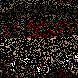
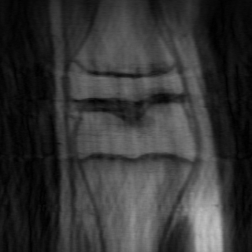
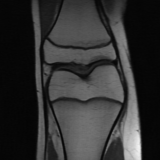

## Equivariant Splitting: Self-supervised learning from incomplete data Official PyTorch implementation

ES reconstructions from incomplete measurements (Inpainting, MRI)

**Equivariant Splitting: Self-supervised learning from incomplete data** 

Abstract: *Self-supervised learning for inverse problems allows to train a reconstruction network from noise and/or incomplete data alone. These methods have the potential of enabling learning-based solutions when obtaining ground-truth references for training is expensive or even impossible. In this paper, we propose a new self-supervised learning strategy devised for the challenging setting where measurements are observed via a single incomplete observation model. We introduce a new definition of equivariance in the context of reconstruction networks, and show that the combination of self-supervised splitting losses and equivariant reconstruction networks results in the same minimizer in expectation as the one of a supervised loss. Through a series of experiments on image inpainting, accelerated magnetic resonance imaging, and compressive sensing, we demonstrate that the proposed loss achieves state-of-the-art performance in settings with highly rank-deficient forward models.*

### Experiments

Equivariant splitting is evaluated on different imaging modalities: compressive sensing, image inpainting and accelerated MRI. The code and instructions to reproduce the results for compressive sensing and inpainting are available [here](cs_inp) and for MRI [here](mri).

### Acknowledgment

This work makes use of the efficient forward operators and training losses in DeepInverse and the convenient MRI training and comparison features of SSIBench.
